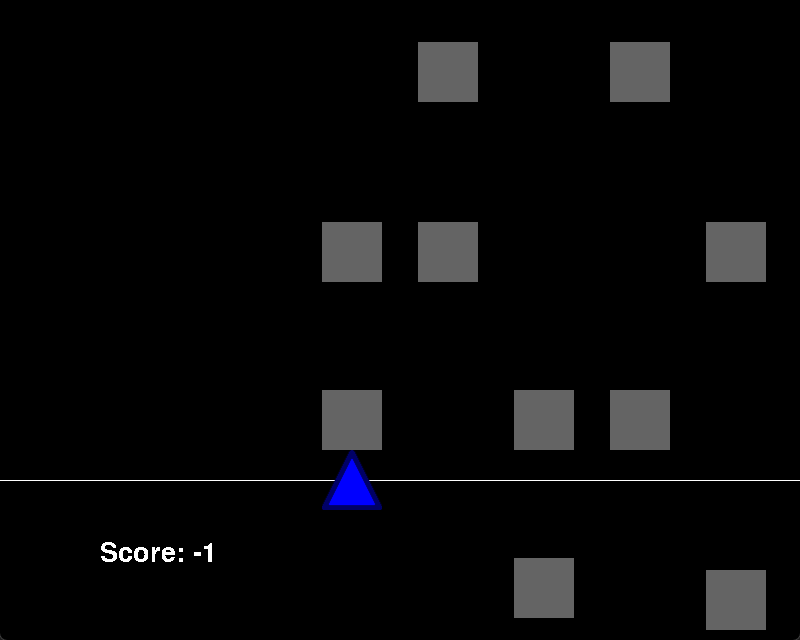

# BeatEater
## Authors: Jakob Karlstrand, Hassan Mustafa and Levi Tuoremaa

A simple PyGame rhythm game that generates levels from user-selected audio tracks.

Dependencies:
PyGame, Aubio, SciPy, PyDub